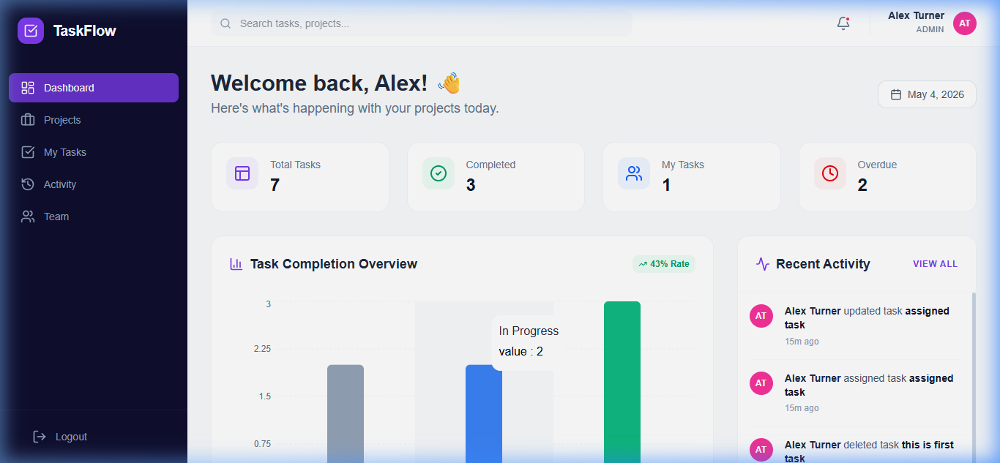
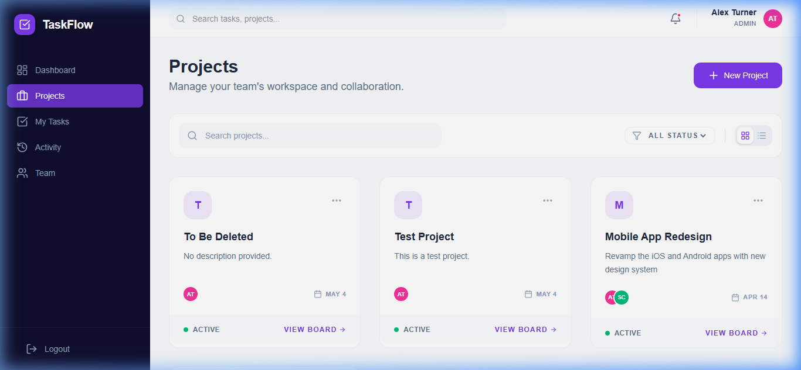
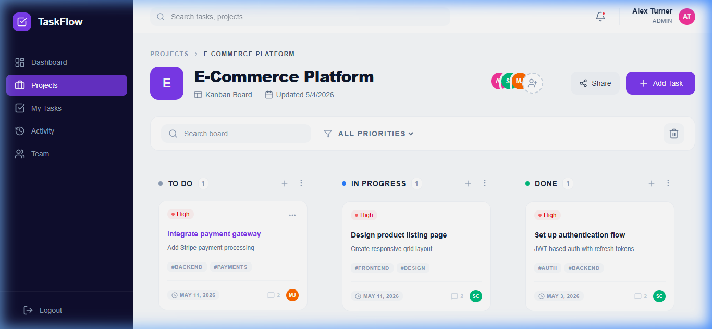
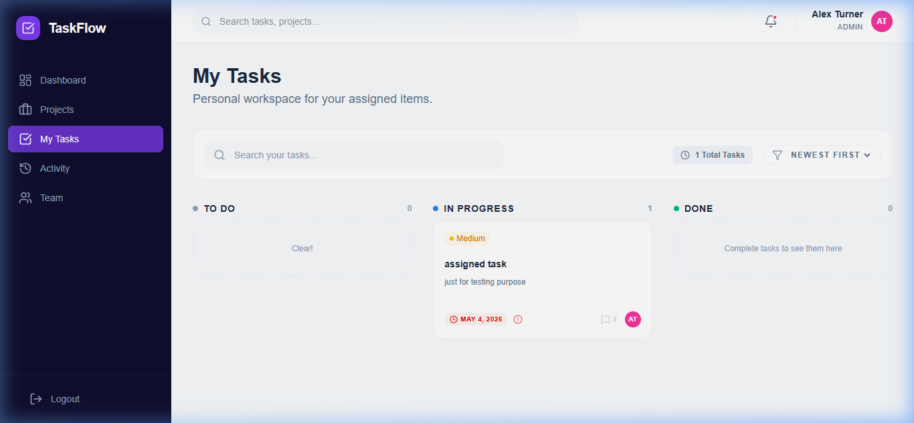
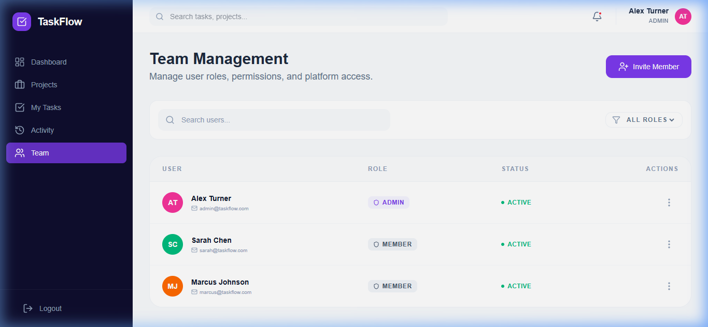

# TaskFlow - Modern Task Management Platform

TaskFlow is a premium, high-performance task management application designed to help teams collaborate effectively. With a sleek, minimalist interface and intuitive Kanban boards, managing your projects has never been easier.

## Key Features

- **Dynamic Dashboard**: Get a bird's-eye view of all your projects, task completion rates, and recent activity.
- **Kanban Board**: Drag-and-drop tasks between "To Do", "In Progress", and "Done" columns.
- **My Tasks**: A personalized workspace showing only the tasks assigned to you.
- **Team Management**: Admins can easily manage team members, roles, and platform access.
- **Premium Aesthetics**: Beautiful dark-themed sidebar, glassmorphism effects, and smooth transitions.

## Screen Gallery

### Main Dashboard
The Dashboard provides an overview of your productivity. Track your total tasks, completion rates, and stay updated with the live activity feed.

### Project Management
Organize your work into separate projects. Toggle between a visual grid view or a high-density list view depending on your preference.

### Interactive Kanban Board
Each project features a powerful Kanban board. Create tasks, assign them to team members, set priorities, and move them across columns with ease.

### My Tasks
A focused view for individuals to see exactly what they need to work on next, sorted by priority or due date.

### Team Management
Admins can invite new members, change roles, and monitor the entire team's status from a central hub.

## How to Get Started (Non-Technical Guide)

### 1. Requirements
Before you begin, ensure you have the following installed on your computer:
- **Node.js**: The engine that runs the application.
- **MongoDB**: The database where all your data is stored.

### 2. Setting Up the Backend (The Brain)
1. Open your terminal (Command Prompt or PowerShell).
2. Navigate to the `backend` folder.
3. Run `npm install` to download necessary files.
4. Run `npm run start:dev` to start the server.

### 3. Setting Up the Frontend (The Interface)
1. Open a new terminal window.
2. Navigate to the `frontend` folder.
3. Run `npm install` to download the design components.
4. Run `npm run dev` to launch the application.
5. Open your browser and go to `http://localhost:5173`.

### 4. Logging In
Use the following credentials to access the demo data:
- **Email**: `admin@taskflow.com`
- **Password**: `Admin@123`

## The User Flow

1. **Login**: Securely log in to your personalized workspace.
2. **Dashboard**: Check your current progress and see what your team has been up to.
3. **Projects**: Choose a project you are working on or create a new one.
4. **Board View**: Add tasks to the "To Do" column. As you work, drag them to "In Progress" and finally to "Done".
5. **My Tasks**: Use this page to focus strictly on your own responsibilities.
6. **Activity Feed**: Keep track of every change made to your projects in real-time.

